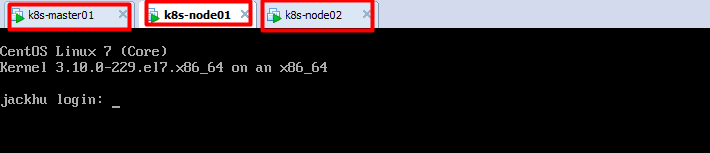
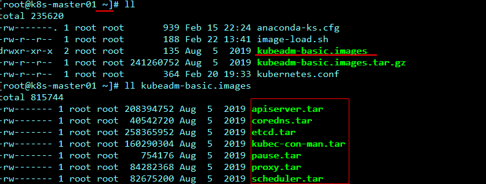
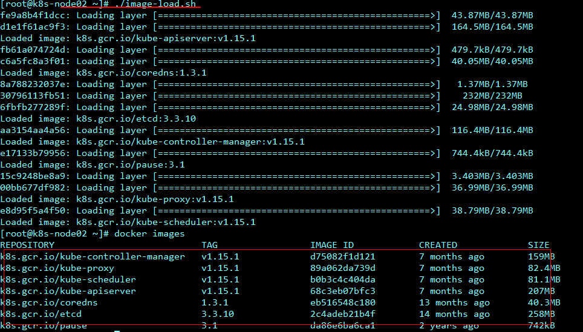
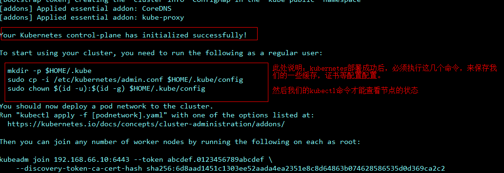
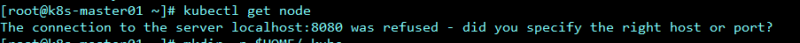
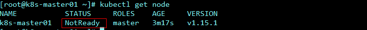
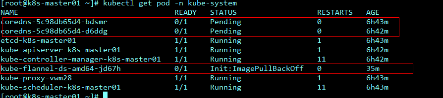
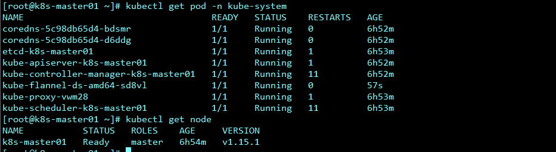
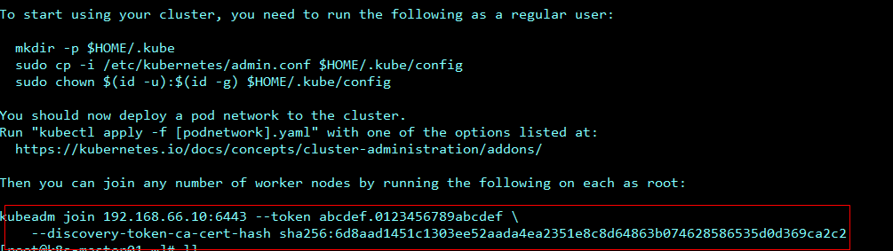
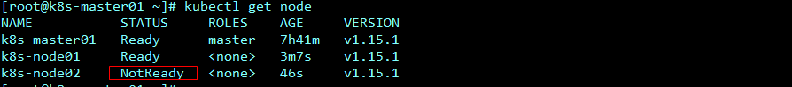

# Kubernetes(K8s)-k8s服务集群安装

# 一、环境准备

## 1、机器环境

节点CPU核数必须是 ：>= 2核 ，否则k8s无法启动

DNS网络： 最好设置为 本地网络连通的DNS,否则网络不通，无法下载一些镜像

linux内核： linux内核必须是 4 版本以上，因此必须把linux核心进行升级


</img>

准备3台虚拟机环境，或者是3台阿里云服务器都可。

k8s-master01:  此机器用来安装k8s-master的操作环境

k8s-node01: 此机器用来安装k8s node节点的环境

k8s-node02: 此机器用来安装k8s node节点的环境


## 2、依赖环境

```bash
#1、给每一台机器设置主机名
hostnamectl set-hostname k8s-master01
hostnamectl set-hostname k8s-node01
hostnamectl set-hostname k8s-node02
#查看主机名
hostname
#配置IP host映射关系
vi /etc/hosts
192.168.66.10 k8s-master01
192.168.66.11 k8s-node01
192.168.66.12 k8s-node02

202.106.0.20

#2、安装依赖环境，注意：每一台机器都需要安装此依赖环境
yum install -y conntrack ntpdate ntp ipvsadm ipset jq iptables curl sysstat libseccomp wget vim net-tools git iproute lrzsz bash-completion tree bridge-utils unzip bind-utils gcc

#3、安装iptables，启动iptables，设置开机自启，清空iptables规则，保存当前规则到默认规则
# 关闭防火墙
systemctl stop firewalld && systemctl disable firewalld
# 置空iptables 
yum -y install iptables-services && systemctl start iptables && systemctl enable iptables && iptables -F && service iptables save

#4、关闭selinux

#闭swap分区【虚拟内存】并且永久关闭虚拟内存
swapoff -a && sed -i '/ swap / s/^\(.*\)$/#\1/g' /etc/fstab
#关闭selinux
setenforce 0 && sed -i 's/^SELINUX=.*/SELINUX=disabled/' /etc/selinux/config


#5、升级Linux内核为4.44版本
rpm -Uvh http://www.elrepo.org/elrepo-release-7.0-4.el7.elrepo.noarch.rpm
#安装内核
yum --enablerepo=elrepo-kernel install -y kernel-lt
#设置开机从新内核启动
grub2-set-default 'CentOS Linux (4.4.189-1.el7.elrepo.x86_64) 7 (Core)'
#注意：设置完内核后，需要重启服务器才会生效。
#查询内核
uname -r

#########################################################################

#6、调整内核参数，对于k8s
cat > kubernetes.conf <<EOF
net.bridge.bridge-nf-call-iptables=1
net.bridge.bridge-nf-call-ip6tables=1
net.ipv4.ip_forward=1
net.ipv4.tcp_tw_recycle=0
vm.swappiness=0
vm.overcommit_memory=1
vm.panic_on_oom=0
fs.inotify.max_user_instances=8192
fs.inotify.max_user_watches=1048576
fs.file-max=52706963
fs.nr_open=52706963
net.ipv6.conf.all.disable_ipv6=1
net.netfilter.nf_conntrack_max=2310720
EOF

#将优化内核文件拷贝到/etc/sysctl.d/文件夹下，这样优化文件开机的时候能够被调用
cp kubernetes.conf /etc/sysctl.d/kubernetes.conf
#手动刷新，让优化文件立即生效
sysctl -p /etc/sysctl.d/kubernetes.conf


#7、调整系统临时区 --- 如果已经设置时区，可略过
#设置系统时区为中国/上海
timedatectl set-timezone Asia/Shanghai
#将当前的 UTC 时间写入硬件时钟
timedatectl set-local-rtc 0
#重启依赖于系统时间的服务
systemctl restart rsyslog
systemctl restart crond

#7、关闭系统不需要的服务
systemctl stop postfix && systemctl disable postfix


#8、设置日志保存方式
#1）.创建保存日志的目录
mkdir /var/log/journal
#2）.创建配置文件存放目录
mkdir /etc/systemd/journald.conf.d
#3）.创建配置文件
cat > /etc/systemd/journald.conf.d/99-prophet.conf <<EOF
[Journal]
Storage=persistent
Compress=yes
SyncIntervalSec=5m
RateLimitInterval=30s
RateLimitBurst=1000
SystemMaxUse=10G
SystemMaxFileSize=200M
MaxRetentionSec=2week
ForwardToSyslog=no
EOF

#4）.重启systemd journald的配置
systemctl restart systemd-journald

#9、打开文件数调整 (可忽略，不执行)
echo "* soft nofile 65536" >> /etc/security/limits.conf
echo "* hard nofile 65536" >> /etc/security/limits.conf

#10、kube-proxy 开启 ipvs 前置条件
modprobe br_netfilter
cat > /etc/sysconfig/modules/ipvs.modules <<EOF
#!/bin/bash
modprobe -- ip_vs
modprobe -- ip_vs_rr
modprobe -- ip_vs_wrr
modprobe -- ip_vs_sh
modprobe -- nf_conntrack_ipv4
EOF
##使用lsmod命令查看这些文件是否被引导
chmod 755 /etc/sysconfig/modules/ipvs.modules && bash /etc/sysconfig/modules/ipvs.modules && lsmod | grep -e ip_vs -e nf_conntrack_ipv4

```


## 3、docker部署

```bash
#1、安装docker
yum install -y yum-utils device-mapper-persistent-data lvm2

#紧接着配置一个稳定（stable）的仓库、仓库配置会保存到/etc/yum.repos.d/docker-ce.repo文件中
yum-config-manager --add-repo https://download.docker.com/linux/centos/docker-ce.repo

#更新Yum安装的相关Docke软件包&安装Docker CE
yum update -y && yum install docker-ce

#2、设置docker daemon文件
#创建/etc/docker目录
mkdir /etc/docker
#更新daemon.json文件
cat > /etc/docker/daemon.json <<EOF
{"exec-opts": ["native.cgroupdriver=systemd"],"log-driver": "json-file","log-opts": {"max-size": "100m"}}
EOF
#注意： 一定注意编码问题，出现错误：查看命令：journalctl -amu  docker 即可发现错误

#创建，存储docker配置文件
mkdir -p /etc/systemd/system/docker.service.d

#3、重启docker服务
systemctl daemon-reload && systemctl restart docker && systemctl enable docker
```


## 4、kubeadm

```bash
#1、安装kubernetes的时候，需要安装kubelet, kubeadm等包，但k8s官网给的yum源是packages.cloud.google.com，国内访问不了，此时我们可以使用阿里云的yum仓库镜像。
cat <<EOF > /etc/yum.repos.d/kubernetes.repo
[kubernetes]
name=Kubernetes
baseurl=http://mirrors.aliyun.com/kubernetes/yum/repos/kubernetes-el7-x86_64
enabled=1
gpgcheck=0
repo_gpgcheck=0
gpgkey=http://mirrors.aliyun.com/kubernetes/yum/doc/yum-key.gpg
       http://mirrors.aliyun.com/kubernetes/yum/doc/rpm-package-key.gpg
EOF

#2、安装kubeadm、kubelet、kubectl
yum install -y kubeadm-1.15.1 kubelet-1.15.1 kubectl-1.15.1
# 启动 kubelet
systemctl enable kubelet && systemctl start kubelet

```


# 二、集群安装

## 1、依赖镜像


上传镜像压缩包，把压缩包中的镜像导入到本地镜像仓库



编写脚本问题，导入镜像包到本地docker镜像仓库：

```bash
# kubeadm 初始化k8s集群的时候，会从gce Google云中下载（pull）相应的镜像,且镜像相对比较大，下载比较慢，且需要解决科学上网的一个问题，国内上goole，懂得...........

#1、导入镜像脚本代码  （在任意目录下创建sh脚本文件：image-load.sh）
#!/bin/bash
#注意 镜像解压的目录位置
ls /root/kubeadm-basic.images > /tmp/images-list.txt
cd /root/kubeadm-basic.images
for i in $(cat /tmp/images-list.txt)
do
        docker load -i $i
done
rm -rf /tmp/images-list.txt

#2、修改权限，可执行权限
chmod 755 image-load.sh 

#3、开始执行,镜像导入
./image-load.sh

#4、传输文件及镜像到其他node节点
#拷贝到node01节点
scp -r image-load.sh kubeadm-basic.images root@k8s-node01:/root/  
#拷贝到node02节点
scp -r image-load.sh kubeadm-basic.images root@k8s-node02:/root/  

#其他节点依次执行sh脚本，导入镜像
```


导入成功后镜像仓库如下图所示：




## 2、k8s部署

```bash
#初始化主节点 --- 只需要在主节点执行

#1、拉去yaml资源配置文件
kubeadm config print init-defaults > kubeadm-config.yaml

#2、修改yaml资源文件
	localAPIEndpoint:
	  advertiseAddress: 192.168.66.10 # 注意：修改配置文件的IP地址
	kubernetesVersion: v1.15.1 #注意：修改版本号，必须和kubectl版本保持一致
	networking:
	  # 指定flannel模型通信 pod网段地址,此网段和flannel网段一致
	  podSubnet: "10.244.0.0/16"
	  serviceSubnet: "10.96.0.0/12"
	#指定使用ipvs网络进行通信
	---
	apiVersion: kubeproxy.config.k8s.io/v1alpha1
	kind: kubeProxyConfiguration
	featureGates:
	  SupportIPVSProxyMode: true
	mode: ipvs

#3、初始化主节点，开始部署
kubeadm init --config=kubeadm-config.yaml --experimental-upload-certs | tee kubeadm-init.log
#注意：执行此命令，CPU核心数量必须大于1核，否则无法执行成功

```

kubernetes主节点初始化成功后，如下所示：



按照k8s指示，执行下面的命令：

```bash

#4、初始化成功后执行如下命令
#创建目录，保存连接配置缓存，认证文件
mkdir -p $HOME/.kube
#拷贝集群管理配置文件
cp -i /etc/kubernetes/admin.conf $HOME/.kube/config
#授权给配置文件
chown $(id -u):$(id -g) $HOME/.kube/config

```

执行命令前查询node:



执行命令后查询node:

</img>

我们发现已经可以成功查询node节点信息了，但是节点的状态却是NotReady,不是Runing的状态。原因是此时我们使用ipvs+flannel的方式进行网络通信，但是flannel网络插件还没有部署，因此节点状态此时为NotReady


## 3、flannel插件


```bash
#部署flannel网络插件 --- 只需要在主节点执行
#1、下载flannel网络插件
wget https://raw.githubusercontent.com/coreos/flannel/master/Documentation/kube-flannel.yml

#2、部署flannel
kubectl create -f kube-flannel.yml

#也可进行部署网络
kubectl apply -f https://raw.githubusercontent.com/coreos/flannel/master/Documentation/kube-flannel.yml
```

 部署完毕查询pod,发现一些异常错误现象：



发现通过flannel部署的pod都出现pending,ImagePullBackOff这样的问题：

查询日志信息，发现了一些错误：

```bash
#查询一个pod的详细信息
kubectl describe pod kube-flannel-ds-amd64-jd67h -n kube-system
kubectl apply -f kube-flannel.yml #服务已正常启动

```

部署flannel网络插件时候，注意网络连通的问题：




## 4、节点Join

构建kubernetes主节点成功，会产生一个日志文件（命令中指定日志输出文件 “tee kubeadm-init.log”），内容如下所示：



红色 部分给出的命令即是把其他节点加入进来的命令。


```bash
# 加入主节点以及其余工作节点，执行安装日志中的命令即可
#查看日志文件
cat kubeadm-init.log
# 负责命令到其他几个node节点进行执行即可
kubeadm join 192.168.66.10:6443 --token abcdef.0123456789abcdef \
    --discovery-token-ca-cert-hash sha256:6d8aad1451c1303ee52aada4ea2351e8c8d64863b074628586535d0d369ca2c2 


```

执行完毕，查看效果如下所示：



发现还有一些节点处于NotReady状态，是因为这些节点pod容器还处于初始化的状态，需要等一点时间：

更详细查看命令，可以看见初始化节点所属节点：

```bash
# 查询工作空间中pod容器的详细信息
kubectl get pod -n kube-system -o wide
```


## 5、私有仓库


```bash

#私有仓库搭建 harbor
# 伪造证书
"insecure-registries": ["https://hub.kaikeba.com"]
# 把证书添加/etc/docker/daemon.json文件中，其的每一个节点都做如下模式添加：伪造证书
{"exec-opts": ["native.cgroupdriver=systemd"],"log-driver": "json-file","log-opts": {"max-size": "100m"},"insecure-registries": ["https://hub.kaikeba.com"]}
# node01 添加 "insecure-registries": ["https://hub.kaikeba.com"]
# node02 添加 "insecure-registries": ["https://hub.kaikeba.com"]

# 伪造证书
vi /etc/docker/daemon.json

#更详细教程，参考私有仓库构建md文档
```


## 6、案例实战


